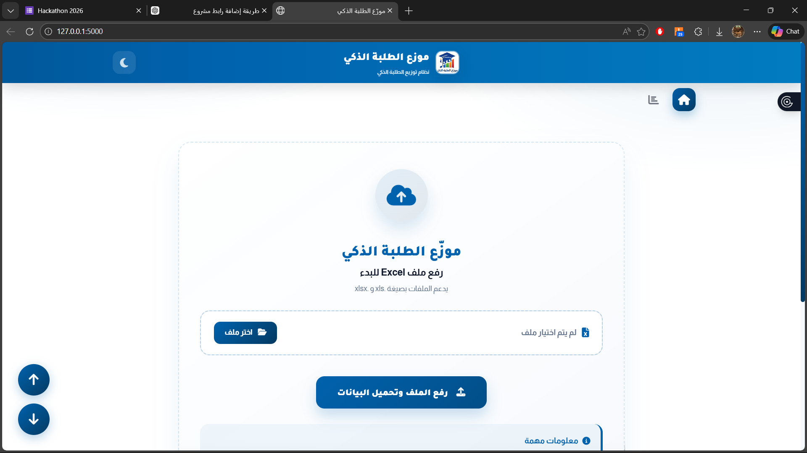

# Student Department Distribution System (Web App)

This project is a web-based system designed to automatically distribute students into academic departments based on multiple criteria, including admission channel, student average, preferences, and department capacity.

The system aims to replace manual distribution with a fair, transparent, and automated solution.

---

## 🚀 Overview

The distribution process is based on:
- Admission channel (General / Martyrs / Parallel)
- Student average (0–100)
- Ordered student preferences
- Department capacity (Equal or Manual)
- Special rule for children of professors (accepted after others with a score margin)

The final results are exported to an Excel file and displayed through a web interface.

---

## 🛠️ Built With

- **Python** (Backend logic)
- **Flask** – Web framework
- **Pandas** – Data processing and Excel handling
- **OpenPyXL** – Excel read/write support
- **HTML/CSS** – Web interface

---

## ✨ Features

- Smart multi-channel student distribution
- Automatic column name normalization
- Priority-based preference allocation
- Equal or manual department capacity assignment
- Special handling for children of professors
- Excel export of final results
- Real-time statistics display
- User-friendly web interface

---

## 📂 Project Structure

```text
student-distribution/
│
├─ app.py
|_static/
    |_logo.png
├─ templates/
│   └─ index.html
│
├─ uploads/        (generated automatically)
├─ README.md
└─ requirements.txt
```


### 1️⃣ Requirements

- Python 3.10+
- pip
- Modern browser

### 2️⃣ Install Dependencies

pip install flask pandas openpyxl numpy

### 3️⃣ Run the Application

python app.py


## Run the Application

From the project directory, run:

```
python app.py

```
You should see:

Running on http://127.0.0.1:5000

Open your browser and go to:

http://127.0.0.1:5000


##  Input Excel Format

The system accepts an .xlsx file containing student data.

Recommended columns:

Student ID

Student Name

Average (0–100)

Admission Channel (General / Martyrs / Parallel)

Is Child of Professor (Yes / No) (optional)

Preference 1, Preference 2, ...

Column names are automatically normalized.
The system can also detect children of professors from the “Notes” column if available.


## Distribution Logic

Students are separated by admission channel.

Each channel is processed independently.

Students are sorted by average (descending).

Allocation is attempted based on ordered preferences.

If no seat is available, the student is marked as Not Accepted.

Children of professors are processed last and may be accepted above capacity if:


```
student_average ≥ (department_minimum - margin)

```


## Output

Excel file containing final distribution results

Accepted department for each student

Department statistics (minimum score & accepted count)

Web-based result preview


## Screenshots

Add screenshots of the web interface below.

Example:




## Troubleshooting

Excel not loading
Install OpenPyXL:

```
pip install openpyxl

```

Page not opening
Make sure the app is running and visit:

```
http://127.0.0.1:5000

```

Unknown admission channel
Ensure values are one of:
General, Martyrs, Parallel


## License

This project is licensed under the MIT License.

## Author
Developed by:

- Rawan Mahdi
- Mariam Ahemad
- Fatima Ahemad

Computer Science Students
